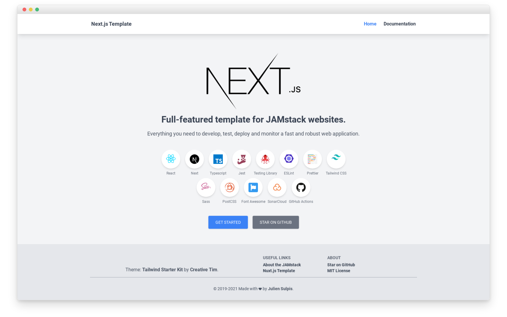

## The Dangers of the Ocean

Software development is like an ocean. It is vast, and seems endless when gazing at the horizon. The waves, winds, and storms can be merciless, sinking your ship and leaving you stranded with no sense of direction. Without a map to navigate this ocean or inform you about the dangers of the ocean, getting to your destination, much less surviving, would be close to impossible. Design patterns are the compass and your guide for your journey—a set of tools and strategies that help programmers carve a clear path through the treacherous waters of coding in the most efficient way. They are the blueprints to your house, or the foundation of your application design. Put simply, design patterns are reusable solutions to recurring problems in software design. These designs are not for specific issues, but are templates that can be altered to several different situations. These designs are a collection of solutions from experienced software developers placed into accessible frameworks, allowing developers to solve problems in a consistent manner. 

## Patterns in Practice

In my coding experience, I have used templates or “blueprints” similar to design patterns which enable me to complete my coding projects and assignments. The most notable one would be the Next.js template for my assignments, and most importantly, coding project final for ICS 314. Although it may not be the traditional example of a design pattern, it is still a form of a design pattern on the architectural level. While traditional design patterns like Singleton or Strategy focus on solving specific software design problems, a Next.js template provides a pre-structured way to build web applications. This aligns with the concept of patterns as reusable solutions to recurring challenges. The challenges it addresses is the recurring issue of creating a performant, SEO-friendly, and scalable React-based web application. By providing a predefined structure for routing, server-side rendering (SSR), static site generation (SSG), and API integration, it solves the common issues developers face when building modern web apps from scratch. With an app that can be launched immediately, developers can instead focus on transforming this template into a website of their preference. The Next.js template has been incredibly beneficial for my final group project as a lot of the headache is taken care of. Now my group can focus on the frontend and backend design of the website, rather than worrying about deployment. 

