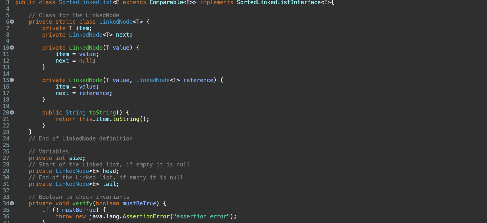

Sorted Linked list is a java program that implements the Linked list class and its basic functions without implementing the actual Linked list class in the java library. There is a add function, remove function, size function, toString function, indexOf function, get function, and a checkInvariants function. Additionally, When new items are added into the linked list, it is automatically sorted. 

For this project, I was the lead programmer and only programmer responsible for creating this program. I started with creating the linked list class and creating the node class. After doing so, I was able to implement the basic functions of the linked list class.

You can learn more here [Github Repo](https://github.com/BYKuwabara/Projects/blob/main/SortedLinkedList.java).
